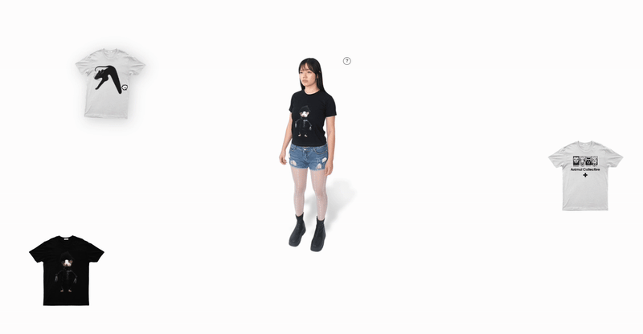

-------

# Interactive Styling Canvas

*A playful experience where you drag and drop virtual t-shirts onto a model to instantly change their look.*

[Article on Codrops](https://tympanus.net/codrops/?p=)

[Demo](https://tympanus.net/Development/.../)

## Installation

Run this demo on a [local server](https://developer.mozilla.org/en-US/docs/Learn/Common_questions/Tools_and_setup/set_up_a_local_testing_server).

## Credits

- Model images by laughwithtic [laughwithtic](https://laughwithtic.com)

## Misc

Follow *Author*: [X](https://x.com/Kaberikram), [Instagram](https://www.instagram.com/kaberikram/), [GitHub](https://github.com/kaberikram) ...

Follow Codrops: [Bluesky](https://bsky.app/profile/codrops.bsky.social), [Facebook](http://www.facebook.com/codrops), [GitHub](https://github.com/codrops), [Instagram](https://www.instagram.com/codropsss/), [X](http://www.x.com/codrops)

## License
[MIT](LICENSE)

